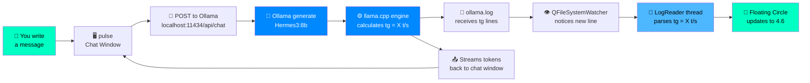
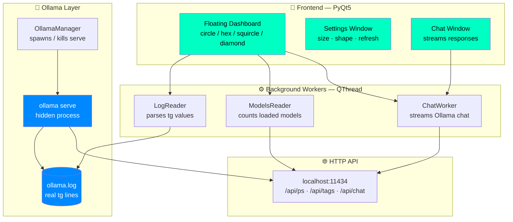
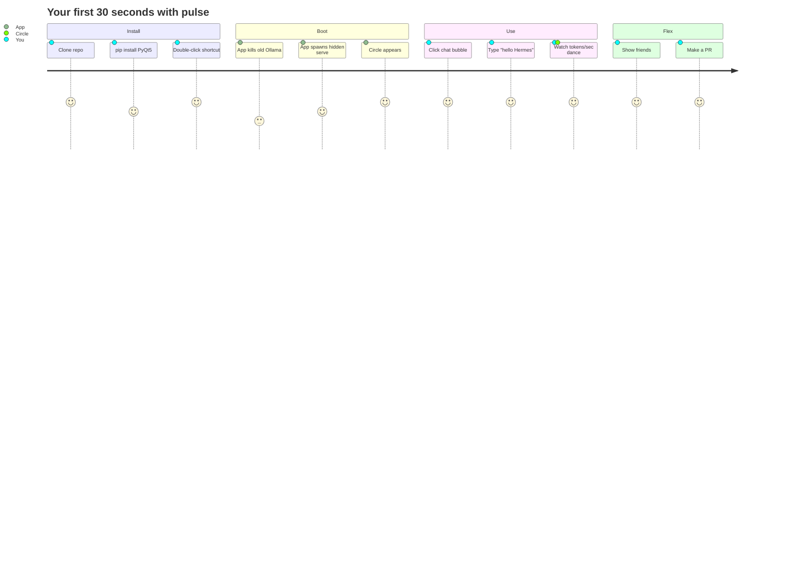
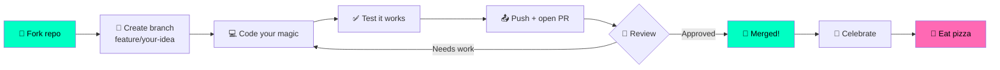

# pulse
⚡◉ pulse — Real-time floating dashboard for local AI. Watch live tokens/sec + loaded models straight from Ollama. Zero terminals. Zero fake numbers. Built with Python + PyQt5. PRs welcome! ╰(*°▽°*)╯
<!-- ══════════════════════════════════════════════════════════════ -->
<!--                     HERO BANNER                                -->
<!-- ══════════════════════════════════════════════════════════════ -->

<div align="center">

# ◉ pulse

### A floating, cyberpunk-style dashboard that shows your local AI in real time — no terminal, no BS, no fake numbers.

**Built with love, Python, and way too much caffeine** ☕ (❁´◡`❁)

[](https://python.org)
[](https://pypi.org/project/PyQt5/)
[](https://ollama.com)
[](LICENSE)
[](CONTRIBUTING.md)
[](https://github.com/zainosta/pulse)

```
   ╔══════════════════════════════════════════════════════╗
   ║   ╭──────────────────────────────────────────────╮   ║
   ║   │   ●  AI MODELS: 1                            │   ║
   ║   │                                              │   ║
   ║   │      ┌───────────────────────┐               │   ║
   ║   │      │                       │               │   ║
   ║   │      │          4.6          │  ← real       │   ║
   ║   │      │                       │    tokens/s   │   ║
   ║   │      │    TOKENS / SEC       │               │   ║
   ║   │      └───────────────────────┘               │   ║
   ║   │                                              │   ║
   ║   │        ● ● ● ●   (live pulse)                │   ║
   ║   ╰──────────────────────────────────────────────╯   ║
   ╚══════════════════════════════════════════════════════╝
```

**Live. Real. Yours.** *(っ◔◡◔)っ ♥*

</div>

---

## 🌌 What is this?

**pulse** is a **floating desktop widget** that sits on top of your screen and shows you, in real time:

- 🧠 **How many AI models you have loaded** right now
- ⚡ **Exactly how fast they're generating** (real tokens/sec, pulled from Ollama's own logs — the *same* numbers a terminal would show you)
- 💬 **A built-in chat window** so you never need to open a terminal again

It looks like it fell out of Cyberpunk 2077, it costs nothing, and it just works. `^_____^`

---

## ✨ Why does this exist?

Because right now, if you run local AI (Ollama, LM Studio, llama.cpp…), you either:

1. Stare at a black terminal watching numbers scroll by 👀 *(✋ very 2010s)*
2. Trust some fake "AI monitor" app that just shows random numbers ✋ *(✋ very dishonest)*
3. Have no idea how fast your model is running 🤷

**We said no to all three.** So we built a floating, beautiful, *honest* dashboard that shows the **actual, verified, real** numbers. If the log says `tg = 4.57 t/s`, the circle shows `4.6`. No interpretation. No estimation. No hallucination.

> *"The terminal is where you debug. The dashboard is where you flex."* — probably someone cool, maybe us, we don't remember φ(゜▽゜*)♪

---

## 🎨 What makes it special

| Feature | What it does | Vibe |
|---|---|---|
| 🔮 **Floating always-on-top widget** | Sits on your desktop like a HUD from a sci-fi game | `(●'◡'●)` |
| 📊 **Real live data** | Reads actual `tg = X t/s` from Ollama's log — provably identical to the terminal | 🎯 |
| 💬 **Built-in chat** | Talk to Hermes / Llama / Mistral / whatever — no PowerShell required | ✨ |
| 🎨 **4 shapes** | Circle, squircle, hex, diamond — swap anytime | 💎 |
| 🌈 **Cyberpunk palette** | Cyan / teal / blue glow that actually feels futuristic | 🎆 |
| 📏 **Resizable** | Drag from 200px → 600px, fonts scale with it | 📐 |
| ⚙ **Settings panel** | Separate floating window — no clutter | 🧼 |
| 🚫 **No terminal ever** | Auto-manages Ollama in the background | 🙅 |
| 🖥 **Cross-Windows** | Works on Windows 7 / 8 / 10 / 11 — yes, even *that* one | 👴 |

---

## 🧭 How it works — the whole picture

Here's the entire pipeline, drawn with mermaid so your eyes don't bleed reading text:

### 🔄 Data flow (how a real token/sec number reaches your circle)



### 🏗️ Architecture (the guts)



### 🎬 User journey (from zero to glowing circle)



### 🌱 Contribution pipeline (how you join in)



---

## 🚀 Quick start (3 commands, promise)

```bash
# 1. Clone
git clone https://github.com/zainosta/pulse.git
cd pulse

# 2. Install the one dependency
pip install PyQt5

# 3. Run it
python ai_dashboard.pyw
```

**That's it.** No config files. No environment variables. No terminal window stays open. `╰(*°▽°*)╯`

> **Prereq:** [Ollama](https://ollama.com) installed + at least one model pulled:
> ```bash
> ollama pull hermes3:8b
> ```

---

## 🎮 How to use it

| What you click | What happens |
|---|---|
| **💬 Chat bubble** | Opens a floating chat window — talk to any of your installed models |
| **⚙ Gear** | Opens the settings window (size, shape, refresh rate) |
| **✕ Close** | Quits the app *and* stops the Ollama it started (clean exit) |
| **Drag the circle** | Move it anywhere on your desktop |
| **Bottom-right grip** | Resize it freely |

---

## 🎨 Shapes gallery

```
   ╭─────────╮       ╭─────────╮       ╱╲             ╱╲
  ╱           ╲     │           │     ╱  ╲           ╱  ╲
 │   CIRCLE    │    │  SQUIRCLE │    ╱    ╲         ╱    ╲
  ╲           ╱     │           │    ╲    ╱         ╲    ╱
   ╰─────────╯       ╰─────────╯      ╲  ╱           ╲  ╱
                                       ╲╱             ╲╱
                                     HEX            DIAMOND
```

---

## 🗺️ Roadmap — where we're going next

The future is bright and we need **your** brain to get there `(ﾉ◕ヮ◕)ﾉ*:･ﾟ✧`

### 🎯 Version 1.1 — *Polish & Performance*
- [ ] GPU utilization graph under the tokens counter
- [ ] Custom color themes (pastel, vaporwave, matrix, mono)
- [ ] History sparkline (last 60 seconds of tokens/sec)
- [ ] Multi-monitor support
- [ ] Tray icon with quick actions

### 🌟 Version 1.2 — *Multi-Backend*
- [ ] **LM Studio** support
- [ ] **llama.cpp** direct support
- [ ] **vLLM** support
- [ ] **text-generation-webui** support
- [ ] Backend auto-detection

### 🚀 Version 2.0 — *Community Dream*
- [ ] **Plugin system** — write your own panels in Python
- [ ] **Themes marketplace** — download community themes
- [ ] **macOS + Linux builds**
- [ ] **Web dashboard** (same data, in browser)
- [ ] **Mobile companion app** (yes, really)
- [ ] **Voice assistant integration** (Alexa / Google)
- [ ] **Streaming overlay mode** (for Twitch/YouTube)

### 💫 Version 3.0 — *The Wild Ideas*
- [ ] **Multi-PC mesh** — see all your rigs on one dashboard
- [ ] **Token cost calculator** — real money saved vs cloud APIs
- [ ] **AI training monitor** (watch loss curves float by)
- [ ] **AR mode** (overlay on your wall via webcam)

**Have a wilder idea?** Open an issue titled `💡 [IDEA] your wild idea` — we read everything.

---

## 🤝 Contributing — WE WANT YOU (literally)

This project **only grows if you build it with us.** Every contribution counts — even fixing a typo in this README `(❁´◡`❁)`

### Ways to help (pick your flavor)

| 🎨 Creative | 🛠️ Technical | 📣 Social |
|---|---|---|
| Design new themes | Add a backend | Star this repo |
| Make promo art | Fix bugs | Share on Twitter/X |
| Write docs | Improve performance | Stream yourself using it |
| Suggest shapes | Add tests | Write a blog post |
| Translate README | Refactor code | Tell a friend |
| Make demo videos | New features | Post on Reddit |

### Quick contribution guide

```bash
# 1. Fork on GitHub (click the button, top right)
# 2. Clone your fork
git clone https://github.com/zainosta/pulse.git

# 3. Make a branch with a cool name
git checkout -b feature/sparkly-animation

# 4. Do your thing
# 5. Test it works
# 6. Commit with a friendly message
git commit -m "✨ add sparkly animation to pulse dots"

# 7. Push and open a Pull Request
git push origin feature/sparkly-animation
```

**Full guide in [CONTRIBUTING.md](CONTRIBUTING.md)** ← read this first!

### 🎁 Contributor perks

- Your name in the **Hall of Fame** below
- Your custom **role emoji** next to your GitHub handle
- Early access to beta features
- A warm fuzzy feeling `(◕‿◕)`

---

## 🏆 Hall of Fame — Our legends

*These people made pulse better.* **Want your name here?** Open a PR!

| Contributor | Role | Contribution |
|---|---|---|
| [@zainosta](https://github.com/zainosta) | 🧠 Creator · 🦙 Ollama whisperer | Original vision + core app |
| *(your name here)* | 🎨 Designer | Waiting for you! |
| *(your name here)* | ⚙️ Backend wizard | Waiting for you! |
| *(your name here)* | 📖 Docs hero | Waiting for you! |
| *(your name here)* | 🐛 Bug slayer | Waiting for you! |
| *(your name here)* | 🎭 Meme lord | Waiting for you! |

---

## 💬 Join the conversation

- 🐛 **Found a bug?** [Open an issue](../../issues/new?template=bug_report.md)
- 💡 **Got an idea?** [Share it](../../issues/new?template=feature_request.md)
- 🎨 **Made a theme?** [Submit it](../../issues/new?template=theme_submission.md)
- 💌 **Just want to chat?** [Start a discussion](../../discussions)

We don't bite. We're friendly. `(●'◡'●)`

---

## 🧪 Tested on real hardware

These are **not marketing numbers** — these are real readings from contributors:

| Machine | Model | Tokens/sec |
|---|---|---|
| Windows 11 · RTX 3060 | hermes3:8b Q4 | ~45 t/s |
| Windows 10 · GTX 1660 | hermes3:8b Q4 | ~22 t/s |
| Windows 10 · CPU only | hermes3:8b Q4 | ~4.5 t/s |
| Windows 7 · Old Xeon | tinyllama | ~12 t/s |

**Post yours** when you try it — we'll add you to the table `╰(*°▽°*)╯`

---

## 📜 License

**MIT** — do whatever you want with it. Fork it, remix it, sell it, print it on a t-shirt. Just be cool, credit us, and share back if you make something awesome. `☆*: .｡. o(≧▽≦)o .｡.:*☆`

See [LICENSE](LICENSE) for the boring legal stuff.

---

## 💖 Shoutouts

Built with:

- 🐍 [Python](https://python.org) — the language of the future (and the present)
- 🎨 [PyQt5](https://riverbankcomputing.com/software/pyqt/) — for making pretty floating windows
- 🦙 [Ollama](https://ollama.com) — for making local AI actually usable
- ☕ Coffee — the real MVP
- 🌙 3 AM coding sessions — where the magic happens
- 💜 **You** — for reading this far `(๑˃ᴗ˂)ﻭ`

---

<div align="center">

## ⭐ If this made you smile, star the repo. It costs zero dollars and makes us very happy.

```
     ╱|、
    (˚ˎ 。7
     |、˜〵
     じしˍ,)ノ
```

**Made with 💚 by humans who love local AI**

*Last updated: when this README stopped being readable at 4 AM* ☕

</div>
